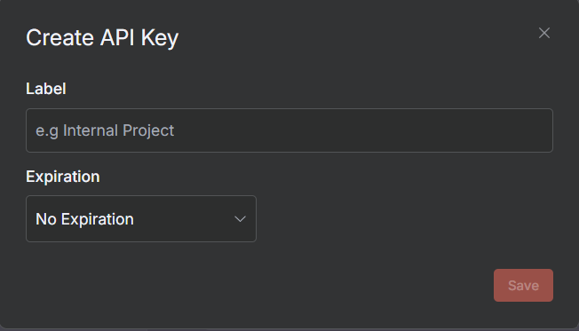
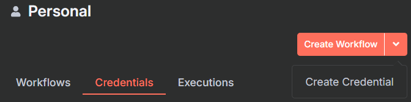
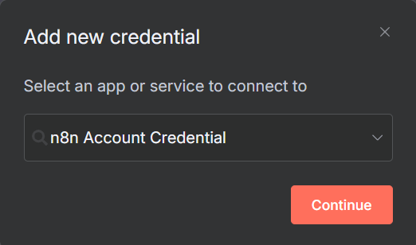
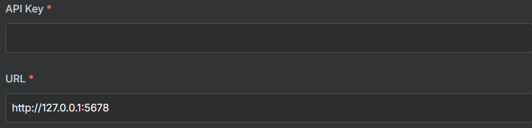
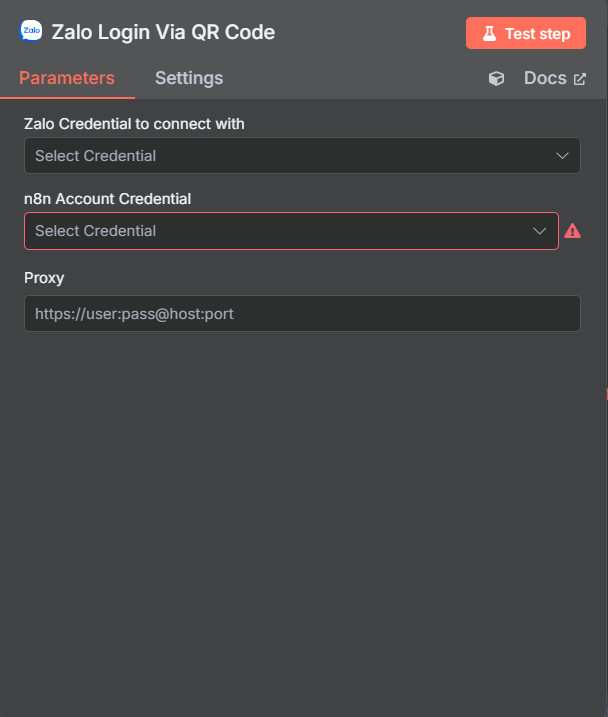

# Thiết lập credentials

Để có thể sử dụng các nodes Zalo bạn phải có Zalo credential. Cách tạo Zalo credential sẽ thông qua một vài bước sau đâu.

## 1. Tạo API Key n8n

Đầu tiên, bạn cần tạo API Key cho n8n:

1. Đăng nhập vào n8n
2. Vào phần "Settings" (Cài đặt)
3. Chọn "API" trong menu bên trái
4. Click "Create New API Key"
5. Lưu lại API Key vừa tạo

## 2. Tạo n8n Credentials
l
Tiếp theo, bạn cần tạo credentials cho n8n:

1. Ở trang chủ n8n, click vào mũi tên bên cạnh nút "Create Workflow"
2. Chọn "Create Credential" từ dropdown hiện ra

3. Trong modal tìm kiếm, sử dụng thanh tìm kiếm để tìm "n8n Zalo Account Credential"

4. Click "Continue"

5. Điền thông tin:

   - API Key: Nhập API Key đã tạo ở bước 1
   - URL: Nhập domain của n8n (ví dụ: `https://example.com`)
   - Lưu ý: URL phải bắt đầu bằng `https://` và không thêm `/api/v1` hay bất kỳ path nào khác

## 3. Tạo Zalo Credentials

Sau khi tạo n8n credentials, bạn cần tạo Zalo credentials:

1. Tạo một workflow mới hoặc vào một workflow có sẵn
2. Kéo node "Zalo Login Via QR" vào workflow
3. Click vào node để mở cấu hình
4. Trong phần "n8n Account Credential", chọn credential đã tạo ở bước 2
5. Để trống phần "Zalo Credential"
6. Click "Test Step" để tạo mã QR
7. Sử dụng Zalo trên điện thoại để quét mã QR
8. Xác nhận đăng nhập trên điện thoại

## 4. Kiểm tra Credentials

Sau khi tạo xong, bạn có thể kiểm tra credentials:

1. Quay lại trang chủ n8n
2. Vào tab "Credentials"
3. Kiểm tra xem đã có Zalo credentials chưa

## Lưu ý quan trọng

- Đảm bảo domain của bạn đã được cấu hình SSL (https)
- API Key cần được bảo mật và không chia sẻ với người khác
- Nếu gặp lỗi khi quét QR, hãy thử:
  - Kiểm tra lại URL đã nhập đúng chưa
  - Kiểm tra kết nối internet
  - Thử tạo lại credentials

